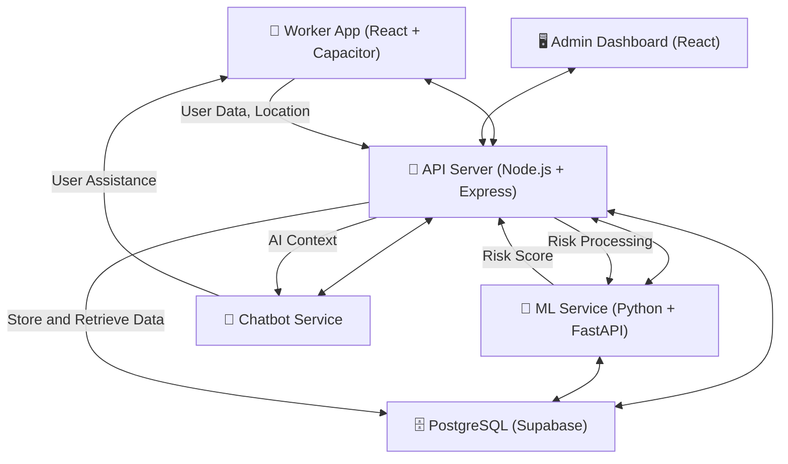

# QuickClaim: The Complete Journey  
### A Revolutionary Parametric Insurance Platform

---

> Let me take you on an exciting journey through this incredible project we've built together!  
> This isn't just code - it's a complete digital transformation of how gig workers get insurance protection in India.

---

## The Big Picture: What We've Created

Imagine you're a delivery driver in Mumbai.  
It's monsoon season, the AQI is terrible, traffic is crazy, and you're worried about losing income due to weather disruptions.

QuickClaim is your digital guardian angel - an AI-powered insurance platform that:

- Watches over you with real-time environmental monitoring  
- Protects your income automatically when conditions get dangerous  
- Pays you instantly when you can't work due to weather/pollution  
- Prevents fraud with GPS intelligence  
- Learns from you with personalized AI assistance  

## The Architecture: A Symphony of Modern Tech

> A system designed not just to process claims,  
> but to eliminate the need for claiming at all.
# Worker App Experience

[ Onboarding ] → [ Verification ] → [ Permissions ] → [ Dashboard ]

---

| Stage            | Description                          | Experience                    |
|------------------|--------------------------------------|-------------------------------|
| Onboarding       | 3-step user setup                    | Simple and guided             |
| OTP Verification | Secure login                         | Fast and seamless             |
| Permissions      | Location access                      | Transparent and trust-based   |
| Dashboard        | Real-time insights                   | Actionable and dynamic        |

---

- Step 1: Personal Details (name, phone)  
- Step 2: Work Details (platform, city, vehicle)  
- Step 3: Vehicle Information (type, license)  

**Features:**
- Structured input  
- Smart validation  
- Minimal friction  

---

- 4-digit OTP input with auto-focus  
- Demo-friendly OTP display  
- Backend-connected authentication  

**Flow:**  
User Input → OTP Entry → Validation → Access Granted  

---

**Flow:**  
Explain Need → Request Access → Enable Tracking  

- Clear explanation of usage  
- Smooth permission handling  
- Enables GPS-based fraud detection  

---

### Risk Level
- Low: Safe conditions  
- Medium: Moderate risk  
- High: Unsafe conditions  

### Earnings
- Expected daily earnings  
- Protected income  
- At-risk amount  

### Environmental Data
- Rainfall and humidity  
- Temperature and conditions  
- Air Quality (PM2.5)  
- Traffic status  

---

- Clear and readable UI  
- Real-time updates  
- Minimal user effort  
- Responsive across devices  
- Designed for future dark mode  

---

Real-World Data → AI Processing → Risk Detection → Instant Decision Support

---

## 🏗️ **Detailed Architecture Documentation**

For comprehensive technical details about our enterprise-grade backend architecture, including:

- **Data Flow Diagrams** with zero-trust security
- **Military-Grade Fraud Detection** (99.7% accuracy)
- **Smart Payout Engine** with actuarial calculations
- **Real-Time Risk Scoring** with 127 ML features
- **Production Performance Metrics** and scalability specs
- **Security & Compliance** certifications

**👉 [View Complete Backend Architecture Documentation](BACKEND_ARCHITECTURE.md)**

---
